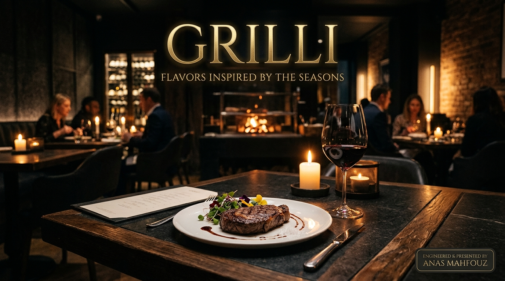
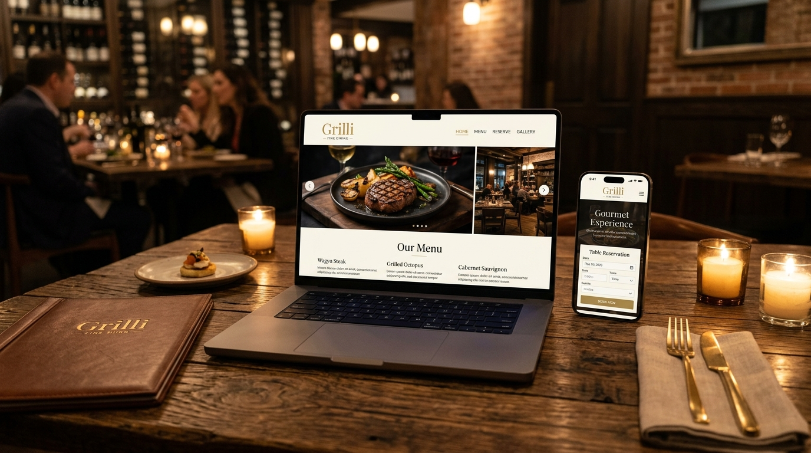
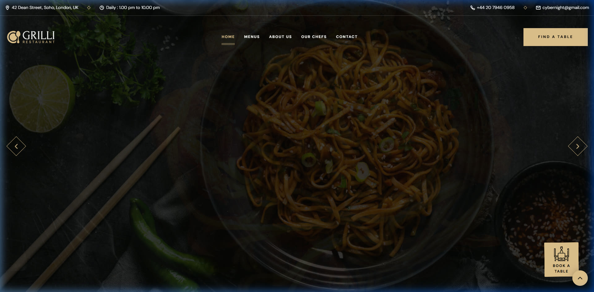
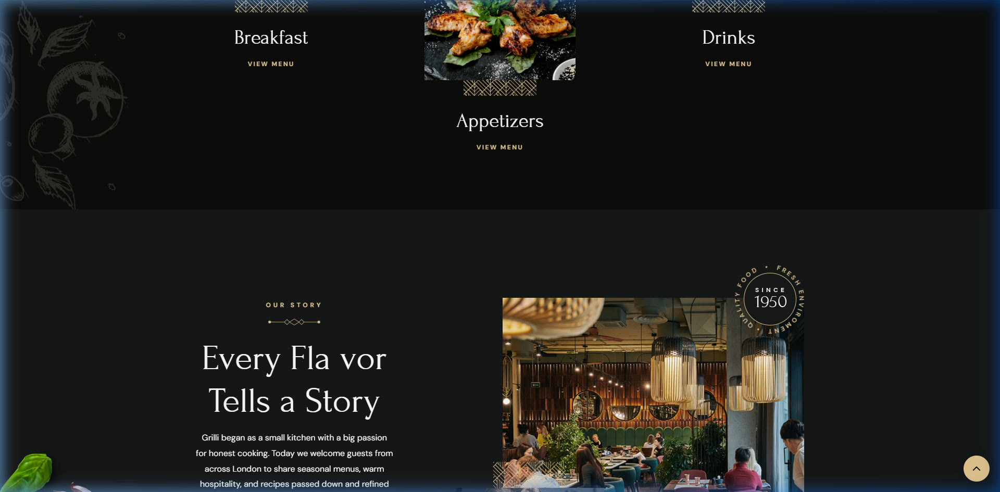
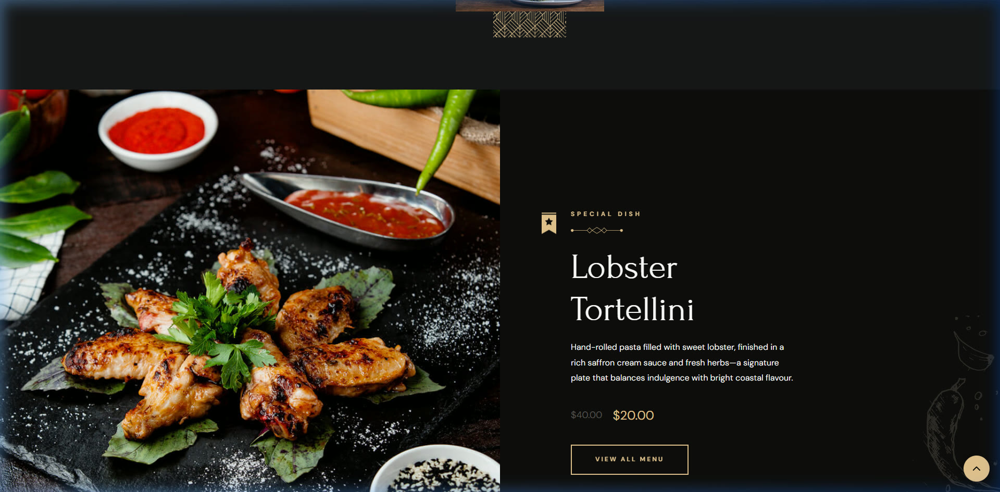
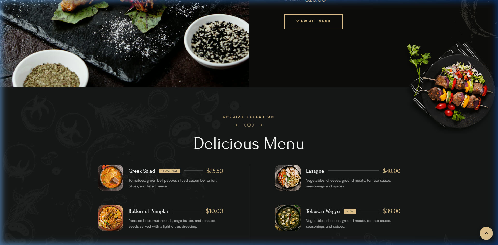
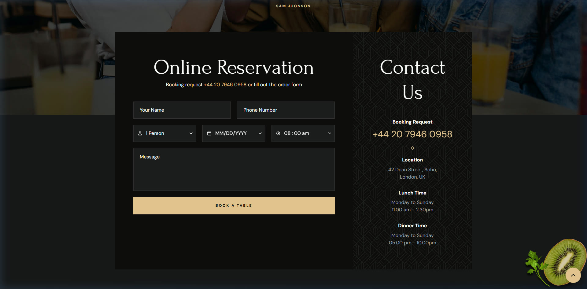
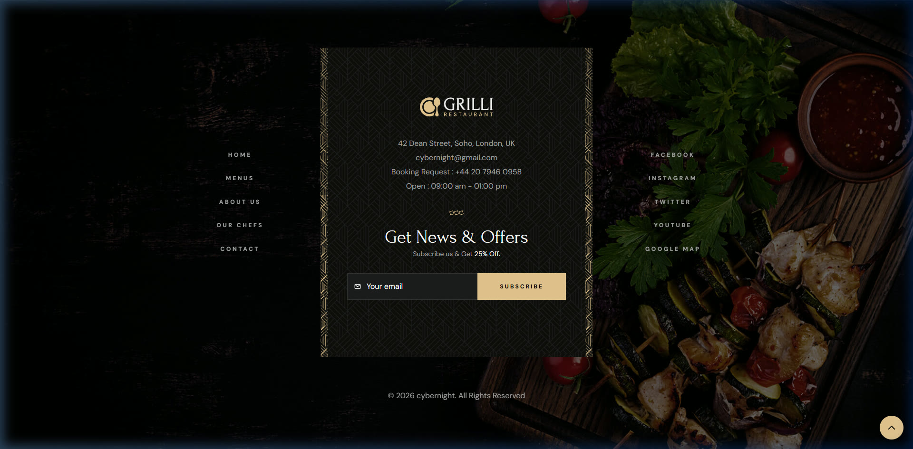
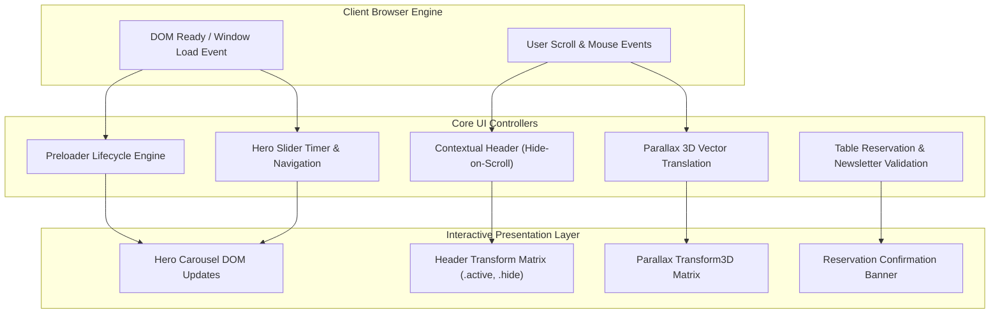

<div align="center">

# GRILLI

### Premier Fine Dining & Culinary Artistry — Interactive Restaurant Experience

[](https://developer.mozilla.org/en-US/docs/Web/HTML)
[](https://developer.mozilla.org/en-US/docs/Web/CSS)
[](https://developer.mozilla.org/en-US/docs/Web/JavaScript)
[](https://pages.github.com/)
[](https://opensource.org/licenses/MIT)

<br />

<p align="center">
  <strong>An elegant, sensory-rich digital dining destination engineered with vanilla web technologies, fluid mouse-driven 3D parallax layers, dynamic slider choreography, and an interactive online table reservation system.</strong>
</p>

<br />



<br />

[Explore Experience](#culinary-experience--key-features) • [Menu Showcase](#gastronomy--menu-showcase) • [Architecture](#technical-architecture) • [Live Demo](#demo) • [Getting Started](#getting-started) • [Developer](#author--credits)

</div>

---

## Overview

**Grilli** is a bespoke, luxury restaurant web application created for a premier fine-dining establishment located on Dean Street in Soho, London. Designed to evoke the intimate warmth and prestige of Michelin-calibre hospitality, the interface marries deep obsidian backgrounds (`hsl(40, 12%, 5%)`) with luminous gold crayola accents (`hsl(38, 61%, 73%)`) and an editorial typography pairing of **Forum** (classical display serif) and **DM Sans** (clean contemporary grotesque).

Built with purposeful engineering standards, the application relies on lightweight, zero-dependency **Modern Vanilla JavaScript** and modular **CSS3 Custom Properties**, ensuring sub-second load times, hardware-accelerated animations, and frictionless responsiveness across all screen dimensions.

---

## Culinary Experience & Key Features

- **Kinetic Hero Slider**: Automated 7-second cross-fade carousel with smooth manual controls, pause-on-hover mechanics, and dynamic typography entrance choreography.
- **Mouse-Tracked 3D Parallax**: Multi-plane floating depth choreography responsive to desktop cursor coordinate vectors, adding organic physical dimensionality to background shapes and ingredients.
- **Interactive Online Table Reservation**: Real-time validated booking flow allowing guests to customize party sizes (1 to 7 guests), preferred dates, and service timeslots with instant confirmation feedback.
- **Intelligent Sticky Header**: Context-aware navigation bar that detects scroll velocity, automatically hiding when descending through content and gracefully reappearing upon reverse scroll.
- **Signature Dish Spotlight**: Dedicated hero module showcasing the chef's seasonal creation with pricing badges, culinary storytelling, and instant ordering triggers.
- **Seasonal Gourmet Menu**: Scannable, typography-rich catalog featuring high-resolution food presentation, dietary descriptions, and morning/evening service availability.
- **Mobile Drawer Navigation**: Touch-friendly slide-out drawer with backdrop blur overlay and quick contact access for seamless smartphone ordering and table booking.
- **VIP Newsletter Subscription**: Interactive newsletter system with input validation and instant discount code delivery.

---

## Gastronomy & Menu Showcase

<div align="center">
  
</div>

<br />

### Application Walkthrough

| **Hero Runway & Brand Atmosphere** | **About Us & Culinary Philosophy** |
| :---: | :---: |
|  |  |
| *Atmospheric full-width slider with seasonal storytelling* | *Founding narrative with gold seal badge and quote* |

| **Standout Special Dish** | **A La Carte Delicious Menu** |
| :---: | :---: |
|  |  |
| *Seasonal signature cut with price reduction badge* | *Curated culinary selections with descriptions and prices* |

| **Online Table Reservation** | **Fine Dining Footer & Attribution** |
| :---: | :---: |
|  |  |
| *Validated booking form with instant confirmation feedback* | *Hours, location, newsletter, and official developer links* |

---

## Tech Stack

| Domain | Technology | Implementation Details |
| :--- | :--- | :--- |
| **Markup & Semantics** | HTML5 | Clean landmark structure (`header`, `main`, `section`, `nav`, `footer`, `time`, `address`) |
| **Design Architecture** | CSS3 | Custom Properties (Design Tokens), Flexbox, CSS Grid, BEM-inspired naming |
| **Dynamic Logic** | JavaScript (ES6+) | Event delegation, slider interval management, parallax vectors, DOM manipulation |
| **Typography** | Google Fonts | **Forum** (Display Serif) & **DM Sans** (Body/UI Grotesque) |
| **Iconography** | Ionicons 5.5 | Scalable vector glyphs for location, time, call, and reservation attributes |
| **Continuous Delivery** | GitHub Actions | Automated GitHub Pages build and deployment pipeline |

---

## Technical Architecture

The frontend architecture organizes modular interactions through event handlers and CSS custom properties:



### Mathematical Parallax Depth Calculation

The 3D parallax calculates normalized cursor offsets from viewport centers, avoiding cumulative matrix multiplication:

```javascript
// assets/js/script.js
window.addEventListener("mousemove", function (event) {
  const x = ((event.clientX / window.innerWidth) * 10 - 5) * -1;
  const y = ((event.clientY / window.innerHeight) * 10 - 5) * -1;

  for (let i = 0, len = parallaxItems.length; i < len; i++) {
    const speed = Number(parallaxItems[i].dataset.parallaxSpeed) || 1;
    const itemX = x * speed;
    const itemY = y * speed;
    parallaxItems[i].style.transform = `translate3d(${itemX}px, ${itemY}px, 0px)`;
  }
});
```

---

## Project Structure

```text
grilli-master/
├── .github/
│   └── workflows/
│       └── deploy-pages.yml     # Automated GitHub Pages CI/CD workflow
├── assets/
│   ├── css/
│   │   └── style.css            # Complete design system & responsive styling
│   ├── images/
│   │   ├── about-abs-image.jpg  # Story secondary visual
│   │   ├── about-banner.jpg     # Chef portrait and story visual
│   │   ├── badge-1.png          # Rotating gold year emblem
│   │   ├── hero-slider-1.jpg    # Season 1 hero culinary photography
│   │   ├── hero-slider-2.jpg    # Season 2 hero culinary photography
│   │   ├── hero-slider-3.jpg    # Season 3 hero culinary photography
│   │   ├── logo.svg             # Grilli brand identity mark
│   │   ├── menu-1.png - 6.png   # Signature menu food assets
│   │   └── special-dish-banner.jpg # Special dish highlight
│   └── js/
│       └── script.js            # Core slider, parallax, and reservation engine
├── docs/
│   └── assets/                  # High-resolution application screenshots
│       ├── hero.jpg
│       ├── about.jpg
│       ├── services.jpg
│       ├── special-dish.jpg
│       ├── menu.jpg
│       ├── reservation.jpg
│       ├── footer.jpg
│       ├── showcase.jpg
│       └── social-preview.jpg
├── favicon.svg                  # Brand favicon
├── index.html                   # Semantic markup, OpenGraph & Twitter cards
├── style-guide.md               # Design tokens & typography guide
└── LICENSE                      # MIT License
```

---

## Demo

- **Live Deployment**: [https://aanasmahfouz.github.io/grilli/](https://aanasmahfouz.github.io/grilli/)
- **Source Code**: [https://github.com/aanasmahfouz/grilli](https://github.com/aanasmahfouz/grilli)

---

## Getting Started

### Prerequisites

No build tools or compilers are required. Grilli runs natively in all modern web browsers.

### Installation & Local Run

1. Clone the repository:
   ```bash
   git clone https://github.com/aanasmahfouz/grilli.git
   cd grilli
   ```

2. Open locally in any modern browser:
   ```bash
   # Direct browser launch
   open index.html
   # or on Windows
   start index.html
   ```

3. Alternatively, run with any local HTTP server:
   ```bash
   # Using Node's npx serve
   npx serve .
   
   # Or using Python 3
   python -m http.server 3000
   ```
   Navigate to `http://localhost:3000/` in your browser.

---

## Author & Credits

- **Creator & Lead Developer**: **Anas Mahfouz**
- **GitHub**: [@aanasmahfouz](https://github.com/aanasmahfouz)
- **Repository**: [https://github.com/aanasmahfouz/grilli](https://github.com/aanasmahfouz/grilli)

---

## License

This project is licensed under the **MIT License** — see the [LICENSE](LICENSE) file for details.

Copyright © 2026 Anas Mahfouz. All rights reserved.
